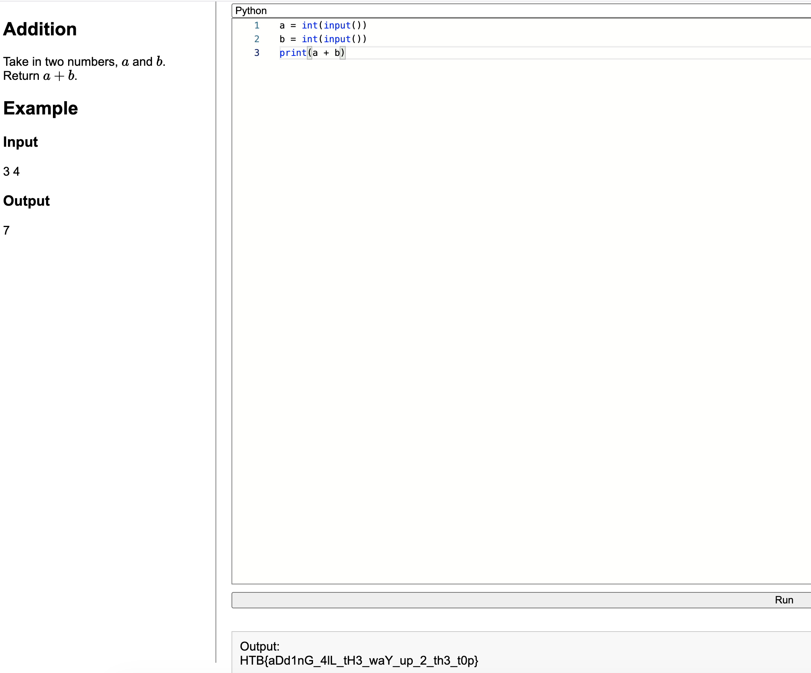

# Addition - HTB Coding Challenge Writeup

**Difficulty:** Very Easy
**Category:** Coding

## Summary
Take two numbers on separate lines, print their sum.

## Walkthrough

Two separate inputs, read each on its own line and add them.

  


```python
a = int(input())
b = int(input())
print(a + b)
```

## Flag
HTB{aDd1nG_4lL_tH3_waY_up_2_th3_t0p}

## Takeaway
Always check how the input is formatted. Same problem, different input format, different solution.

## Takeaway
Simple addition but worth noting the inputs come on separate lines, not space-separated on one line.
