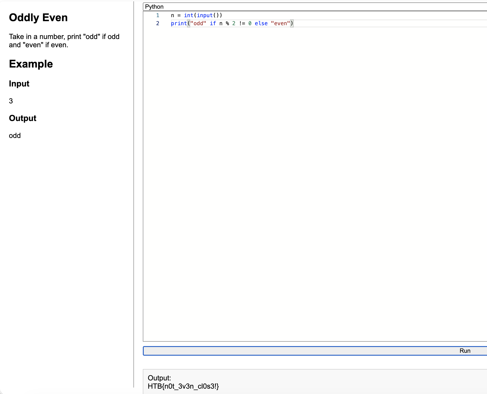

# Oddly Even - HTB Coding Challenge Writeup

**Difficulty:** Very Easy  
**Category:** Coding

## Summary
Take a number, print "odd" if odd and "even" if even.

## Walkthrough

One line. Use the modulo operator to check divisibility by 2.




```python
n = int(input())
print("odd" if n % 2 != 0 else "even")
```

## Flag

```
HTB{n0t_3v3n_cl0s3!}
```

## Takeaway
`n % 2` returns the remainder when dividing by 2. If it's not 0, the number is odd. That's it.