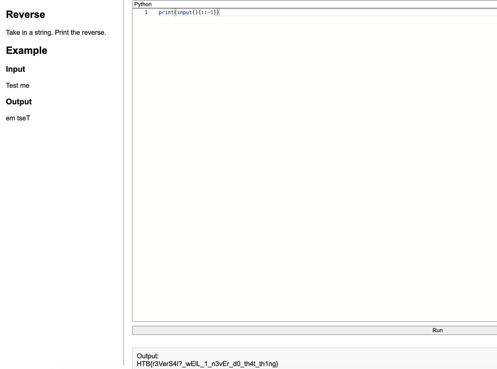

# Reversal - HTB Coding Challenge Writeup

**Difficulty:** Very Easy  
**Category:** Coding

## Summary
Take a string, print it reversed.

## Walkthrough

One line using Python slice notation. `[::-1]` steps through the string backwards.



```python
print(input()[::-1])
```

## Flag
HTB{r3VerS4l?_wElL_1_n3vEr_d0_th4t_th1ng}

## Takeaway
`[::-1]` is the most Pythonic way to reverse a string. The slice syntax is `[start:stop:step]`, a step of -1 means go backwards through the whole thing.
