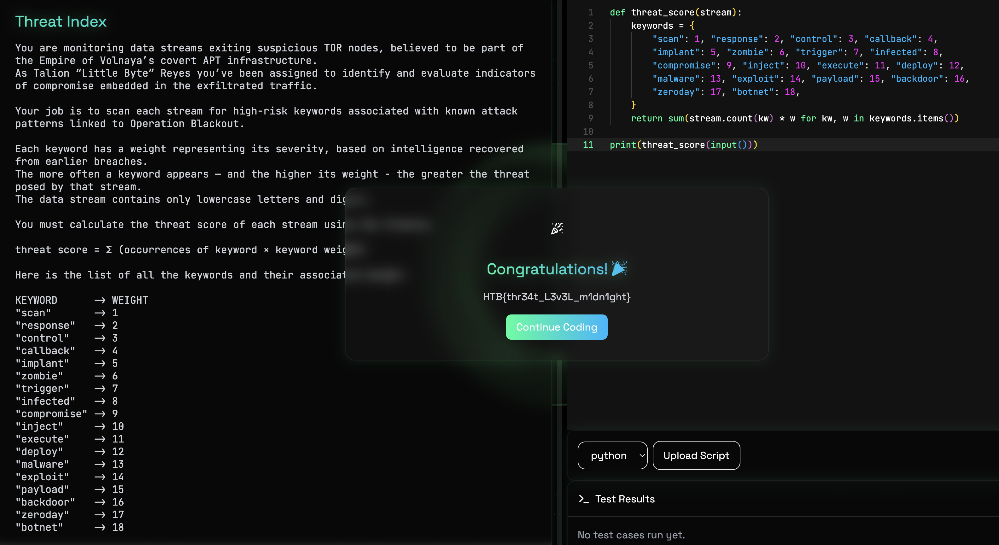

# Threat Index — HTB Coding Challenge Writeup

**Difficulty:** Very Easy   
**Category:** Coding

## Summary
Scan a data stream for 18 weighted keywords, sum occurrences times weight, print the score.

## Walkthrough

For each keyword, count how many times it appears in the stream and multiply by its weight. `str.count()` handles the substring search, and a single sum comprehension ties it all together.




```python
def threat_score(stream):
    keywords = {
        "scan": 1, "response": 2, "control": 3, "callback": 4,
        "implant": 5, "zombie": 6, "trigger": 7, "infected": 8,
        "compromise": 9, "inject": 10, "execute": 11, "deploy": 12,
        "malware": 13, "exploit": 14, "payload": 15, "backdoor": 16,
        "zeroday": 17, "botnet": 18,
    }
    return sum(stream.count(kw) * w for kw, w in keywords.items())

print(threat_score(input()))
```

## Flag
`HTB{thr34t_L3v3L_m1dn1ght}`